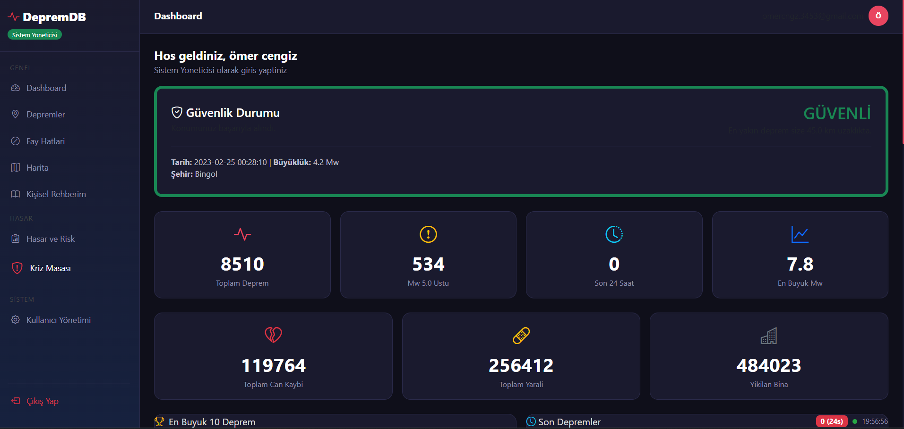
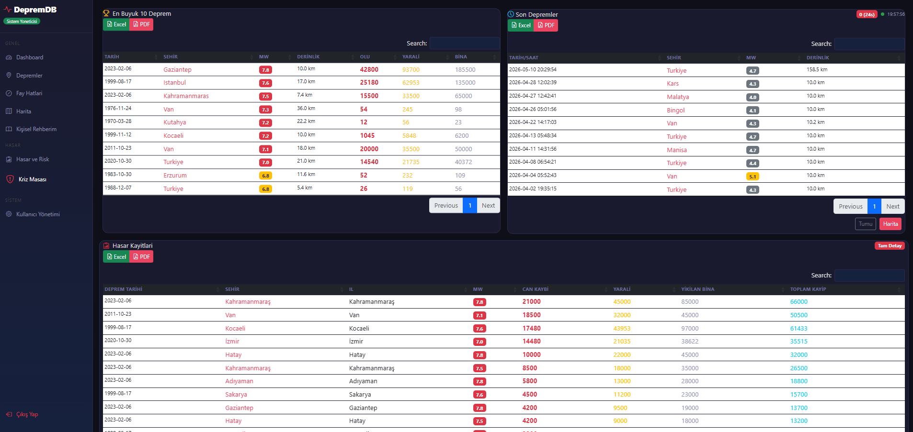
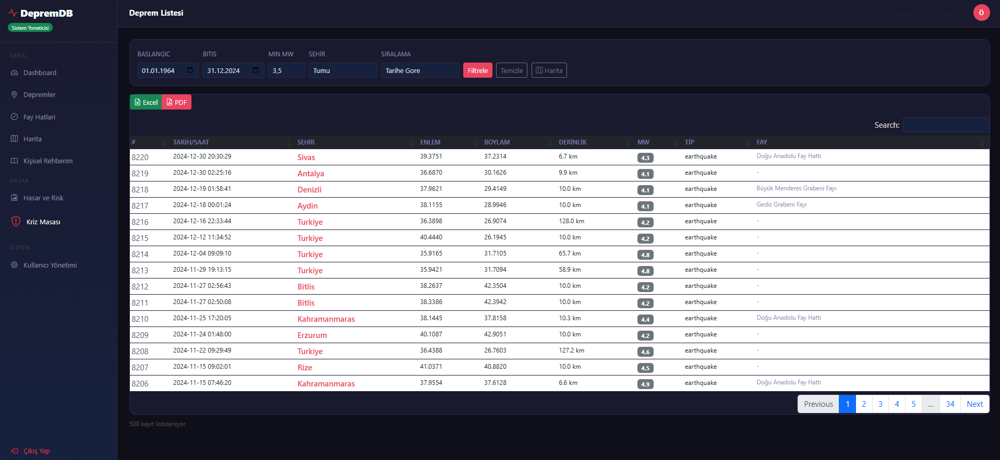
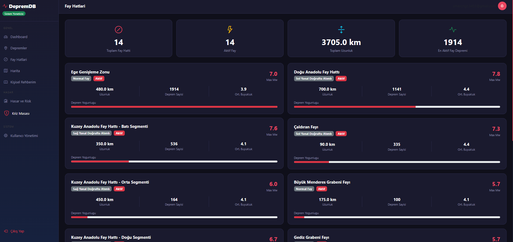
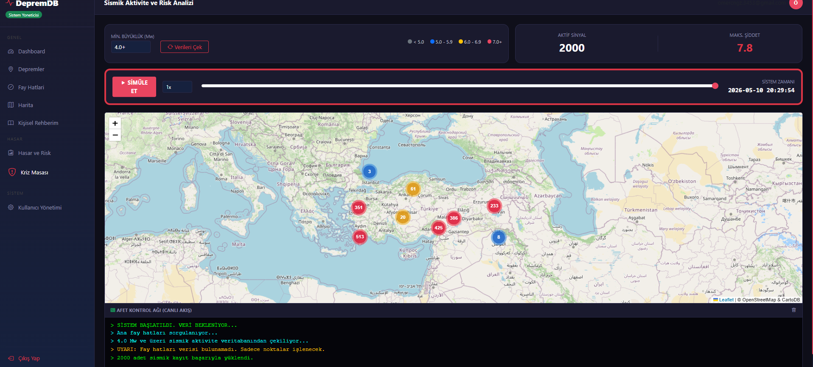
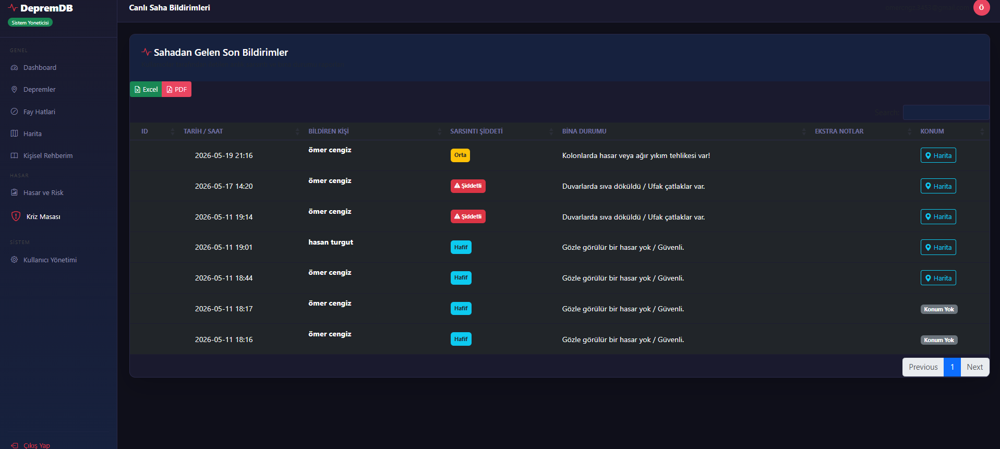
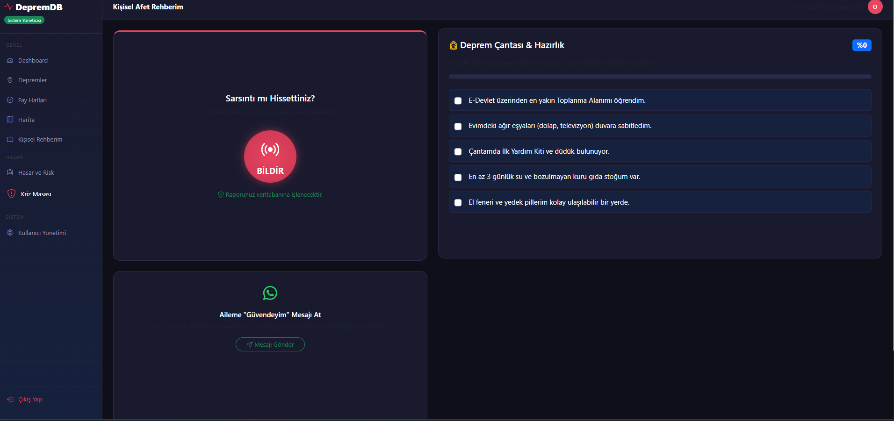
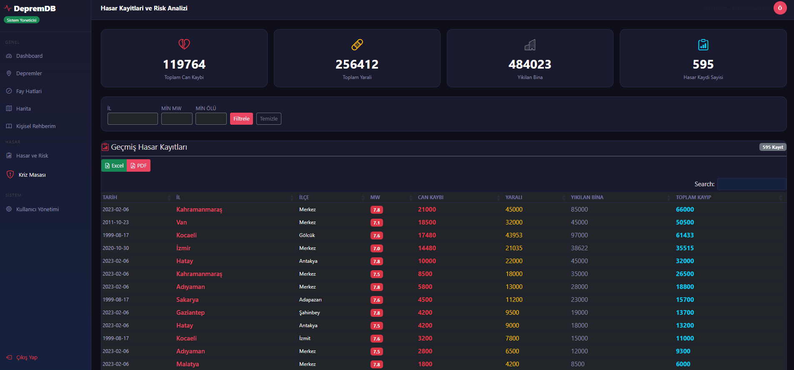
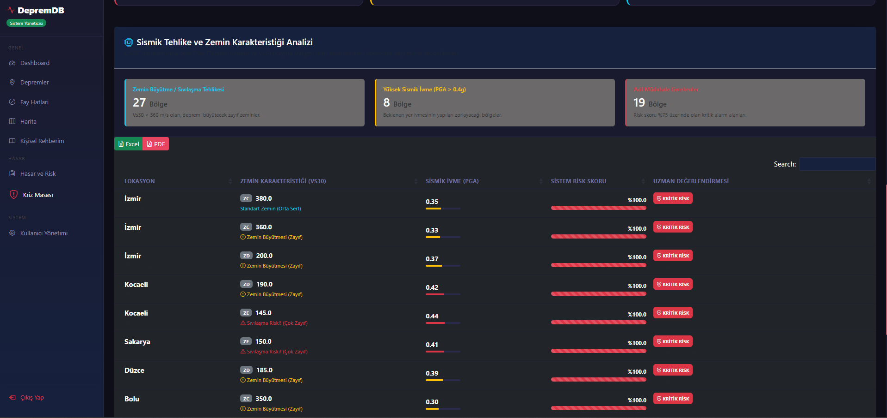
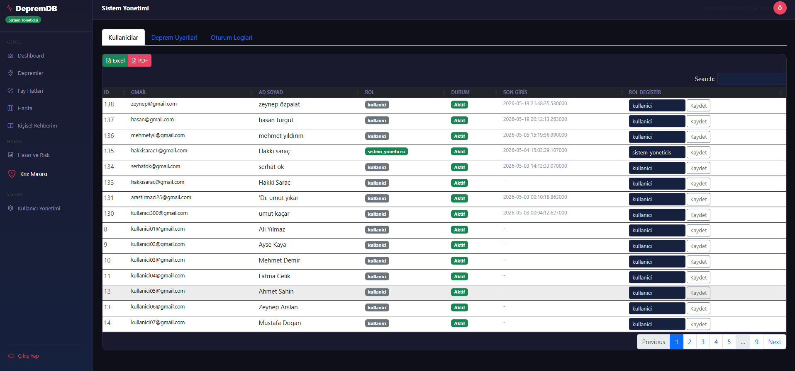

# 🌍 Deprem DB - Bilgi ve Kriz Yönetim Sistemi

**Türkiye'deki deprem verilerini kayıt altına alan, analiz eden ve afet anındaki koordinasyonu destekleyen rol tabanlı web uygulaması.**

*Bu proje, 2026 yılı Veritabanı Yönetim Sistemleri / Yazılım Projesi dersi kapsamında Ömer Cengiz ve Hakkı Saraç tarafından geliştirilmiştir.*

---

## 📸 Ekran Görüntüleri

### 📊 Yönetim Dashboard'u

 

###  Deprem Listesi
 

###  Fay Hatları
 

### 🗺️ Canlı Deprem Haritası

### ⚠️ Kriz Masası & Bildirimler
 

### 📈 Risk & Zemin Analizi
   

###  Kullanıcı Yönetimi
 

---

## 📑 İçindekiler
- [Genel Bakış](#-genel-bakış)
- [Özellikler](#-özellikler)
- [Roller ve Yetkiler](#-roller-ve-yetkiler)
- [Mimari ve Teknolojiler](#-mimari-ve-teknolojiler)
- [Kurulum Rehberi](#-kurulum-rehberi)
- [USGS Veri Aktarımı](#-usgs-veri-aktarımı)

---

## 🔎 Genel Bakış
Deprem anında ve sonrasında verinin tek merkezden, doğru yönetilmesi hayati önem taşır. **Deprem DB**, dağınık durumdaki afet süreçlerini tek bir platformda toplar:
- Geçmiş ve güncel deprem verileri filtrelenebilir, harita üzerinde anlık incelenebilir.
- Zemin ve tehlike parametreleriyle bölgesel risk analizi yapılır.
- Depremi hisseden kullanıcıların konum destekli bildirimleri, Kriz Masası üzerinden yetkililerce takip edilir.
- Veriler, **USGS API** üzerinden otomatik bir arka plan servisiyle sisteme entegre edilir.

---

## ✨ Özellikler

- **Gelişmiş Filtreleme:** Depremleri büyüklük, tarih, şehir veya hasar durumuna göre sorgulama.
- **Kriz Koordinasyonu:** Kullanıcılardan gelen "Bina Yıkıldı", "Şiddetli Hissettim" gibi bildirimlerin anlık olarak yönetimi.
- **Dinamik Risk Analizi:** Zemin sınıfı, Vs30, PGA değerleri üzerinden otomatik risk skoru hesaplama.
- **Görsel İstatistikler:** Yıllık ve aylık deprem dağılımları, şehir bazlı grafiksel raporlar.
- **Rol Tabanlı Erişim:** Araştırmacı, Afet Yöneticisi ve Sistem Yöneticisi için özel tasarlanmış yetki seviyeleri.
- **Güvenlik:** Bcrypt ile şifrelenmiş parolalar, güvenli oturum yönetimi ve loglama.

---

## 👥 Roller ve Yetkiler

| Modüller / Sayfalar | Kullanıcı | Araştırmacı | Afet Yöneticisi | Sistem Yöneticisi |
| :--- | :---: | :---: | :---: | :---: |
| **Temel Modüller (Harita, Depremler, Rehber)** | ✅ | ✅ | ✅ | ✅ |
| **Kriz Bildirimi Gönderme** | ✅ | ✅ | ✅ | ✅ |
| **Gelişmiş İstatistikler** | ❌ | ✅ | ✅ | ✅ |
| **Kriz Masası Yönetimi** | ❌ | ✅ | ✅ | ✅ |
| **Bölgesel Risk Analizi** | ❌ | ❌ | ✅ | ✅ |
| **Yönetim Paneli (Kullanıcı Atamaları)** | ❌ | ❌ | ❌ | ✅ |

---

## 💻 Mimari ve Teknolojiler

**Backend & Veritabanı:**
- **Python & Flask:** Web sunucusu ve API rotaları.
- **Microsoft SQL Server:** T-SQL, karmaşık View'lar ve Stored Procedure'ler (Örn: `sp_DepremEtkiAnalizi`).
- **pyodbc:** Veritabanı bağlantısı.

**Frontend:**
- **HTML5, CSS3, JavaScript** ve **Jinja2** (Dinamik şablon motoru).

**Entegrasyonlar:**
- **USGS Earthquake API:** Güncel sismik verilerin çekilmesi.

---

## ⚙️ Kurulum Rehberi

Projeyi yerel ortamınızda çalıştırmak için aşağıdaki adımları izleyin:

**1. Projeyi Klonlayın:**

git clone https://github.com/omercngz345/DEPREM.DB.git cd depremdb   cd depremdb
2. Sanal Ortamı Oluşturun

Windows PowerShell:

python -m venv .venv

Sanal ortamı aktif edin:

.venv\Scripts\activate

Başarılı olduğunda terminalin başında:

(.venv)
3. Veritabanının Hazırlanması:

SQL Server Management Studio (SSMS) açın.

sql/01_deprem_db.sql dosyasını çalıştırarak veritabanı şemasını oluşturun.

4. Ortam Değişkenleri (.env):

copy .env.example .env komutu ile şablonu kopyalayın ve içerisindeki DB_USER, DB_PASS gibi değerleri kendi sunucunuza göre düzenleyin.

5. Uygulamayı Başlatın:

python app.py
(Tarayıcınızdan http://localhost:5000 adresine giderek sistemi kullanmaya başlayabilirsiniz.)

🌍 USGS Veri Aktarımı
Sistemin veritabanını güncel tutmak için, arka planda USGS verilerini çeken modülü şu komutla çalıştırabilirsiniz:

python python/usgs_import.py
(İşlem detayları anlık olarak python/usgs_import.log dosyasına kaydedilir.)

**Ne yapman gerekiyor?**
Sadece `` kısımlarındaki `dashboard1.png` gibi isimleri, senin `docs` klasörünün içindeki **gerçek resim isimleriyle** değiştirmen yeterli. Kod çalıştığında resimler doğrudan boyutlandırılmış ve hizalanmış olarak README sayfasında şak diye görünecektir.

<FollowUp label="LinkedIn gönderisi de hazır mı?" query="Bu projeyi LinkedIn'de görselleriyle beraber paylaşmak istiyorum, bana dikkat çekici bir post metni hazırlar mısın?"/>DEPREM BİLGİ VE KRİZ YÖNETİM SİSTEMİ
Proje Bilgileri

Proje Adı: DEPREM DB

Geliştirici: Ömer Cengiz, Hakkı Saraç

Ders: Veritabanı Yönetim Sistemleri / Yazılım Projesi

Yıl: 2026

Projenin Amacı

Bu proje, Türkiye'de meydana gelen depremlerin kayıt altına alınması, izlenmesi, analiz edilmesi ve kriz yönetimi süreçlerinin desteklenmesi amacıyla geliştirilmiştir.

Sistem sayesinde deprem verileri görüntülenebilmekte, hasar kayıtları takip edilebilmekte, risk analizleri yapılabilmekte ve afet yönetimi süreçleri tek bir platform üzerinden yönetilebilmektedir.

Ayrıca USGS (United States Geological Survey) tarafından yayınlanan deprem verileri sisteme otomatik olarak aktarılabilmektedir.

Kullanılan Teknolojiler:

Backend
  Python
  Flask
Veritabanı
  Microsoft SQL Server
Frontend
  HTML5
  CSS3
JavaScript
  Jinja2 Template Engine
Veri Kaynağı
  USGS Earthquake API

Sistem Modülleri

Kullanıcı Giriş Sistemi
  Kullanıcı doğrulama
  Yetkilendirme işlemleri
  Oturum yönetimi
Deprem Yönetimi
  Deprem kayıtlarının listelenmesi
  Deprem detaylarının görüntülenmesi
  Filtreleme ve sorgulama
Hasar Yönetimi
  Hasar kayıtlarının tutulması
  Bölgesel hasar analizleri
  Can ve mal kaybı istatistikleri
Risk Analizi
  Risk seviyelerinin belirlenmesi
  Bölgesel risk değerlendirmesi
  Kritik bölgelerin tespiti
Harita Modülü
  Depremlerin harita üzerinde görüntülenmesi
  Konum bazlı inceleme
Kriz Masası
  Acil durum yönetimi
  Afet koordinasyon süreçleri
Fay Bilgileri
  Fay hatlarının görüntülenmesi
  Fay bazlı deprem incelemeleri
İstatistik Modülü
  Deprem dağılımları
  Bölgesel analizler
  Grafiksel raporlar
Yönetim Paneli
  Sistem yönetimi
  Kullanıcı işlemleri
  Veri yönetimi

DEPREM DB
│
├── app.py
├── requirements.txt
│
├── python
│   ├── usgs_import.py
│   
│
├── sql
│   └── 01_deprem_db.sql
│
├── web
│   └── templates
│       ├── base.html
│       ├── login.html
│       ├── dashboard.html
│       ├── depremler.html
│       ├── faylar.html
│       ├── harita.html
│       ├── hasar.html
│       ├── istatistik.html
│       ├── kayit.html
│       ├── kriz_masasi.html
│       ├── rehber.html
│       ├── risk.html
│       └── yonetim.html
│
└── README.txt
│
└── .gitignore
│
└── .env.example

Kurulum Adımları
1. SQL Server Kurulumu

Microsoft SQL Server'ın kurulu ve çalışır durumda olması gerekmektedir.

2. Veritabanının Oluşturulması

sql/01_deprem_db.sql

dosyası SQL Server Management Studio (SSMS) üzerinden çalıştırılmalıdır.

Bu işlem sonucunda sistem için gerekli:
  Veritabanı
  Tablolar
  İlişkiler
  Kısıtlamalar
Oluşturulacaktır.

3. Python Ortamının Hazırlanması

Komut satırında proje klasörüne geçiniz.

pip install -r requirements.txt

komutunu çalıştırarak gerekli kütüphaneleri yükleyiniz.

4. Veritabanı Bağlantısının Ayarlanması

app.py içerisinde bulunan SQL Server bağlantı bilgileri kendi sisteminize göre düzenlenmelidir.

Örnek:

server = 'localhost'
database = 'DepremDB'
username = 'sa'
password = '********'

5. Uygulamanın Çalıştırılması
python app.py

komutunu çalıştırınız.

Uygulama başlatıldıktan sonra aşağıdaki adres üzerinden erişim sağlanabilir:

http://localhost:5000

USGS Veri Aktarma Modülü

Sistemde bulunan:

      python/usgs_import.py

dosyası kullanılarak güncel deprem verileri USGS servislerinden çekilebilir.

Çalıştırmak için:

      python python/usgs_import.py

komutu kullanılabilir.İşlem kayıtları:

python/usgs_import.log   dosyasında tutulmaktadır.

Gereksinimler

Python 3.10 veya üzeri
Microsoft SQL Server
SQL Server Management Studio (SSMS)
Modern web tarayıcısı (Chrome, Edge, Firefox)

Proje Özeti

Bu proje; deprem verilerinin yönetimi, risk analizleri, hasar kayıtları, afet koordinasyonu ve kriz yönetimi süreçlerini desteklemek amacıyla geliştirilmiş web tabanlı bir bilgi sistemidir.

Sistem Python-Flask mimarisi kullanılarak geliştirilmiş olup veriler Microsoft SQL Server üzerinde saklanmaktadır.

Not:Teslim sırasında aşağıdaki dosya ve klasörlerin gönderilmesine gerek yoktur:

.venv/
.venv-1/
.vscode/
__pycache__/
.env

Bu dosyalar geliştirme ortamına ait olup projenin çalışması için gerekli değildir.

Proje Sahibi: Ömer Cengiz, Hakkı Saraç
Teslim Tarihi: ____________
Versiyon: 1.0.0
